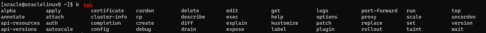
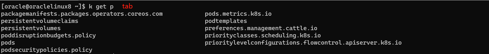
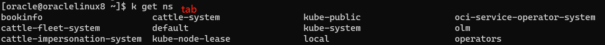

[返回OKE中文文档集](../../README.md)

[返回kubernetes中文文档集](../README.md)

# kubectl_自动补全

安装kubectl，

```
curl -LO "https://dl.k8s.io/release/$(curl -L -s https://dl.k8s.io/release/stable.txt)/bin/linux/amd64/kubectl"
sudo install -o root -g root -m 0755 kubectl /usr/local/bin/kubectl
```

或者安装指定版本，

```
curl -LO https://dl.k8s.io/release/v1.25.0/bin/linux/amd64/kubectl
sudo install -o root -g root -m 0755 kubectl /usr/local/bin/kubectl
```


执行下面命令设置`kubect`和`k`(kubect的alias)实现自动补全，

```
# 在你的 bash shell 中永久地添加自动补全
echo "source <(kubectl completion bash)" >> ~/.bashrc 
echo "alias k=kubectl" >> ~/.bashrc
echo "complete -o default -F __start_kubectl k" >> ~/.bashrc
source ~/.bashrc
```

实现的效果是，当我们输入`kubectl`或者`k`的命令后，按下`tab`键，会自动提示命令的补全，提高输入的效率，

示例1，



示例2，



示例3，



完结！

[返回kubernetes中文文档集](../README.md)

[返回OKE中文文档集](../../README.md)
