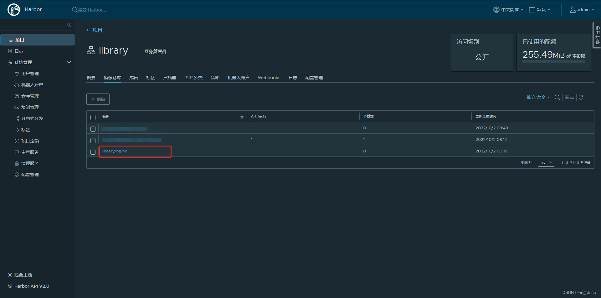

[返回OKE中文文档集](../../README.md)

[返回kubernetes中文文档集](../README.md)

# 使用OCI的Arm实例和对象存储搭建Harbor

## 事情准备
- 准备好arm架构的实例，防火墙开放80和443端口，设置selinux为permissive
- 设置好虚拟云网络的安全列表，开放80和443端口
- 创建好客户密钥（甲骨文云用户详细=>客户密钥=>生成密钥）

## 第1步，准备自签名证书
我们创建一个目录`/root/certs`来保存证书，示例中使用"myserver.local"作为一级域名，"oracle.myserver.local"作为二级域名。
```sh
mkdir -p /root/certs; cd /root/certs
openssl genrsa -des3 -passout pass:123456 -out ca.key 2048
openssl rsa -in ca.key -passin pass:123456 -out ca.key
openssl req -x509 -new -nodes -key ca.key -sha256 -days 3650 -out ca.crt -subj "/CN=myserver.local"
openssl genrsa -out tls.key 2048
openssl req -new -key tls.key -out tls.csr -subj "/CN=myserver.local"
cat > server.ext <<EOF
authorityKeyIdentifier=keyid,issuer
basicConstraints=CA:FALSE
keyUsage = digitalSignature, nonRepudiation, keyEncipherment, dataEncipherment
subjectAltName = @alt_names

[alt_names]
DNS.1 = *.myserver.local
DNS.2 = *.oracle.myserver.local
EOF

openssl x509 -req -in tls.csr -CA ca.crt -CAkey ca.key -CAcreateserial -out tls.crt -days 3650 -extfile server.ext
```

## 第2步，安装Docker-ce
这次咱们使用虚拟机搭建Harbor，需要使用docker和docker-compose，先来安装docker，
```sh
sudo yum install -y yum-utils
sudo yum-config-manager \
   --add-repo \
   https://download.docker.com/linux/centos/docker-ce.repo

cat >> /etc/yum.repos.d/docker-ce.repo << "EOF"
[centos-extras]
name=Centos extras aarch64 - $basearch
baseurl=http://mirror.centos.org/altarch/7/extras/aarch64/
enabled=1
gpgcheck=1
gpgkey=https://www.centos.org/keys/RPM-GPG-KEY-CentOS-7-aarch64
EOF

sudo yum install -y docker-ce docker-ce-cli containerd.io docker-compose-plugin
sudo systemctl start docker
sudo systemctl enable docker
```
安装docker-compose，2022年10月2日时点最新版本是2.11.2版，最新版本请查看[https://github.com/docker/compose/releases](https://github.com/docker/compose/releases)，
```sh
sudo curl -L https://github.com/docker/compose/releases/download/v2.11.2/docker-compose-`uname -s`-`uname -m` -o /usr/local/bin/docker-compose
sudo chmod +x /usr/local/bin/docker-compose
```

## 第3步，构建arm镜像
Docker Hub上并没有Harbor arm架构的镜像，所以需要咱们自己构建arm架构的镜像，直接在甲骨文arm架构的虚拟机上执行下面命令，全部完成需要15-30分钟，
```sh
sudo yum install -y git
git clone https://github.com/goharbor/harbor-arm.git; cd harbor-arm
mkdir -p src/github.com/goharbor/; cd src/github.com/goharbor/
git clone https://github.com/goharbor/harbor.git
cd -

make compile_redis
make prepare_arm_data
make pre_update
make compile COMPILETAG=compile_golangimage
make build GOBUILDTAGS="include_oss include_gcs" BUILDBIN=true NOTARYFLAG=true TRIVYFLAG=true CHARTFLAG=true GEN_TLS=true PULL_BASE_FROM_DOCKERHUB=false
```

## 第4步，安装Harbor
安装Harbor，2022年10月2日时点最新版本是v2.6.0版，最新版本请查看[https://github.com/goharbor/harbor/releases](https://github.com/goharbor/harbor/releases)，
```sh
mkdir -p /u01/apps; cd /u01/apps
wget https://github.com/goharbor/harbor/releases/download/v2.6.0/harbor-offline-installer-v2.6.0.tgz
tar zxvf harbor-offline-installer-v2.6.0.tgz; cd harbor
```
修改`install.sh`，我们使用自己构建的镜像，不需要load Harbor离线安装包里面的镜像，
```sh
vi install.sh
修改前
---
docker load -i ./harbor*.tar.gz
---
修改后
---
# docker load -i ./harbor*.tar.gz
---
```
修改`prepare`，我们使用自己构建的镜像，自己构建的镜像默认的tag是`dev-arm`，
```sh
vi prepare
修改前
---
# goharbor/prepare:v2.6.0 prepare $@
---
修改后
---
goharbor/prepare:dev-arm prepare $@
---
```
创建`harbor.yml`，并修改其中一些配置项，其中的域名和证明书等信息，还有甲骨文云对象存储的信息，请务必根据实际情况修改，
```yaml
cp harbor.yml.tmpl harbor.yml
vi harbor.yml
---
hostname: harbor.oracle.myserver.local
https:
  certificate: /root/certs/tls.crt
  private_key: /root/certs/tls.key
harbor_admin_password: <your_password>
database:
  password: <your_password>
storage_service:
  s3:
    accesskey: <your_accesskey>
    secretkey: <your_secretkey>
    region: ap-seoul-1
    regionendpoint: https://<your_tenant_name>.compat.objectstorage.ap-seoul-1.oraclecloud.com/
    bucket: <you_bucket_name>
    encrypt: false
    secure: false
    v4auth: true
    chunksize: 5242880
    multipartcopychunksize: 33554432
    multipartcopymaxconcurrency: 100
    multipartcopythresholdsize: 33554432
    rootdirectory: /
uaa:
  ca_file: /root/certs/ca.crt
---
```
执行`install.sh`进行安装，
```sh
./install.sh
```
完成后，我们可以通过`docker ps`命令查看启动的容器，
```sh
CONTAINER ID   IMAGE                                 COMMAND                  CREATED             STATUS                    PORTS                                                                            NAMES
8483c4725176   goharbor/harbor-jobservice:dev-arm    "/harbor/entrypoint.…"   About an hour ago   Up 59 minutes (healthy)                                                                                    harbor-jobservice
1f11750b86a1   goharbor/nginx-photon:dev-arm         "nginx -g 'daemon of…"   About an hour ago   Up 59 minutes (healthy)   0.0.0.0:80->8080/tcp, :::80->8080/tcp, 0.0.0.0:443->8443/tcp, :::443->8443/tcp   nginx
0c71a48b5d23   goharbor/harbor-core:dev-arm          "/harbor/entrypoint.…"   About an hour ago   Up 59 minutes (healthy)                                                                                    harbor-core
0ba0b7cde559   goharbor/harbor-db:dev-arm            "/docker-entrypoint.…"   About an hour ago   Up 59 minutes (healthy)                                                                                    harbor-db
838984417adf   goharbor/harbor-portal:dev-arm        "nginx -g 'daemon of…"   About an hour ago   Up 59 minutes (healthy)                                                                                    harbor-portal
ee866b3d94a9   goharbor/registry-photon:dev-arm      "/home/harbor/entryp…"   About an hour ago   Up 59 minutes (healthy)                                                                                    registry
ca76a456c772   goharbor/redis-photon:dev-arm         "redis-server /etc/r…"   About an hour ago   Up 59 minutes (healthy)                                                                                    redis
5939c8137b13   goharbor/harbor-registryctl:dev-arm   "/home/harbor/start.…"   About an hour ago   Up 59 minutes (healthy)                                                                                    registryctl
9717182d4fc6   goharbor/harbor-log:dev-arm           "/bin/sh -c /usr/loc…"   About an hour ago   Up 59 minutes (healthy)   127.0.0.1:1514->10514/tcp                                                        harbor-log
```

## 第5步，访问Harbor
配置hosts文件的域名解析，
```sh
<your_harbor_ip> harbor.oracle.myserver.local
```

浏览器导入自制证书的ca.crt，以火狐(Firefox)为例，设置=>证书=>查看证书，点击导入，选择`ca.crt`，勾选2个信任选择。

使用浏览器访问，`https://harbor.oracle.myserver.local`，用户名是`admin`，密码是`harbor.yml`里面配置的`<your_password>`，


## 第6步，上传镜像进行检证，
由于我们使用的是自签名证书，需要配置让docker信任这个自签名证书，
```sh
sudo mkdir -p /etc/docker/certs.d/harbor.oracle.myserver.local
sudo cp /root/certs/ca.crt /etc/docker/certs.d/harbor.oracle.myserver.local/

sudo systemctl daemon-reload
sudo systemctl restart docker
```
我们试试登录和上传镜像，
```sh
docker login harbor.oracle.myserver.local
>admin
><your_password>

dokcer pull nginx:latest
docker tag nginx:latest harbor.oracle.myserver.local/library/nginx:latest
docker push harbor.oracle.myserver.local/library/nginx:latest
```
成功后，可以通过浏览器看见nginx的镜像已经存在library的库中了，

完结！


[返回kubernetes中文文档集](../README.md)

[返回OKE中文文档集](../../README.md)

