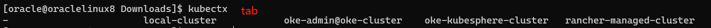
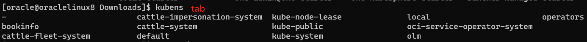
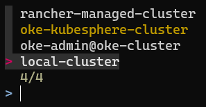
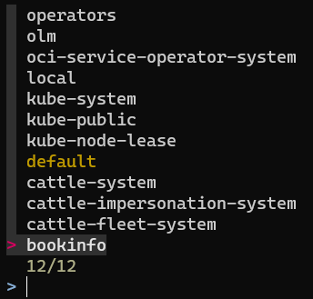

[返回OKE中文文档集](../../README.md)

[返回kubernetes中文文档集](../README.md)

# 通过kubectx和kubens快速切换context和namespace

当我们管理多个kubernetes集群时，kubectx命令可以帮助我们实现在不同集群之间的快速切换，kubenx命令可以帮助我们快速设置默认的namespace。

命令格式为，

```
kubectx <new_dafault_context>
kubens <new_dafault_namespace>
```

安装kubectx和kubens，

```
sudo git clone https://github.com/ahmetb/kubectx /opt/kubectx
sudo ln -s /opt/kubectx/kubectx /usr/local/bin/kubectx
sudo ln -s /opt/kubectx/kubens /usr/local/bin/kubens
```

设置自动补全，

```
COMPDIR=$(pkg-config --variable=completionsdir bash-completion)
sudo ln -sf /opt/kubectx/completion/kubens.bash $COMPDIR/kubens
sudo ln -sf /opt/kubectx/completion/kubectx.bash $COMPDIR/kubectx
```

并且我们可以通过安装fzf实现交互式的选择设置内容，

```
git clone --depth 1 https://github.com/junegunn/fzf.git ~/.fzf
~/.fzf/install
source ~/.bashrc
```

验证kubectx、kubens、fzf的功能，

- kubectx自动补全，



- kubens自动补全，



- kubectx&fzf交互式选择要使用的context，




- kubens&fzf交互式选择要设置的默认namespace，



完结！

[返回kubernetes中文文档集](../README.md)

[返回OKE中文文档集](../../README.md)