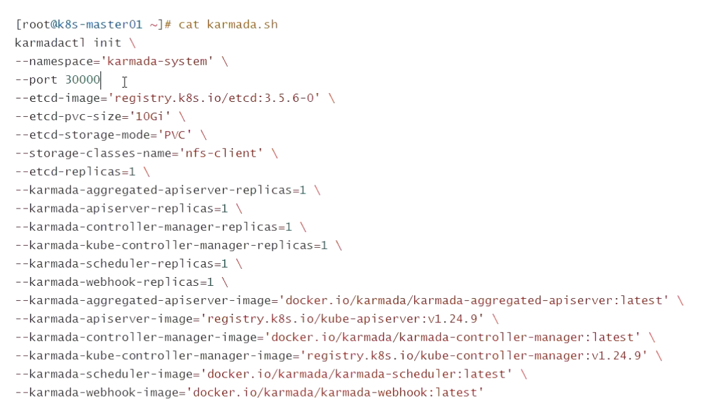

[返回OKE中文文档集](../README.md)

# Rancher和OKE及OCI的集成

## 1. 安装kubectl-karmada

您可以从[karmada 发布](https://github.com/karmada-io/karmada/releases)版中选择适合您的正确插件版本。以v1.3.1版本为例，

```
wget https://github.com/karmada-io/karmada/releases/download/v1.3.1/kubectl-karmada-linux-amd64.tgz
tar -zxf kubectl-karmada-linux-amd64.tgz

sudo chmod +x ./kubectl-karmada
sudo mv ./kubectl-karmada /usr/local/bin
```

验证安装，

```
kubectl karmada version
```

输出示例，

```
kubectl karmada version: version.Info{GitVersion:"v1.3.1", GitCommit:"1fe31b182a6d251e09528530ec51de8adb42d202", GitTreeState:"clean", BuildDate:"2022-10-10T09:34:36Z", GoVersion:"go1.18.3", Compiler:"gc", Platform:"linux/amd64"}
```

## 2.安装Karmada到OKE集群

必须使用root用户进行操作，

```
kubectl karmada init
```

输入日志，

```
I1027 04:24:33.357715  190760 deploy.go:145] kubeconfig file: /root/.kube/config, kubernetes: https://10.0.0.81:6443
W1027 04:24:33.443503  190760 node.go:30] the kubernetes cluster does not have a Master role.
I1027 04:24:33.443524  190760 node.go:38] randomly select 3 Node IPs in the kubernetes cluster.
I1027 04:24:33.454290  190760 deploy.go:165] karmada apiserver ip: [10.0.10.205 10.0.10.46]
I1027 04:24:34.082896  190760 cert.go:229] Generate ca certificate success.
I1027 04:24:34.252185  190760 cert.go:229] Generate karmada certificate success.
I1027 04:24:34.322790  190760 cert.go:229] Generate apiserver certificate success.
I1027 04:24:34.509298  190760 cert.go:229] Generate front-proxy-ca certificate success.
I1027 04:24:34.601957  190760 cert.go:229] Generate front-proxy-client certificate success.
I1027 04:24:34.771420  190760 cert.go:229] Generate etcd-ca certificate success.
I1027 04:24:34.980763  190760 cert.go:229] Generate etcd-server certificate success.
I1027 04:24:35.074321  190760 cert.go:229] Generate etcd-client certificate success.
I1027 04:24:35.074557  190760 deploy.go:258] download crds file name: /etc/karmada/crds.tar.gz
Downloading...[ 100.00% ]
Downloading...[ 100.00% ]
Download complete.I1027 04:24:35.934456  190760 deploy.go:504] Create karmada kubeconfig success.
I1027 04:24:35.971553  190760 namespace.go:36] Create Namespace 'karmada-system' successfully.
I1027 04:24:36.057712  190760 rbac.go:60] CreateClusterRole karmada-controller-manager success.
I1027 04:24:36.073113  190760 rbac.go:81] CreateClusterRoleBinding karmada-controller-manager success.
I1027 04:24:36.101501  190760 secret.go:78] secret kubeconfig Create successfully.
I1027 04:24:36.349562  190760 secret.go:78] secret etcd-cert Create successfully.
I1027 04:24:36.750711  190760 secret.go:78] secret karmada-cert Create successfully.
I1027 04:24:37.150615  190760 secret.go:78] secret karmada-webhook-cert Create successfully.
I1027 04:24:37.543447  190760 services.go:66] service etcd create successfully.
I1027 04:24:37.543468  190760 deploy.go:323] create etcd StatefulSets
W1027 04:24:37.743092  190760 check.go:101] etcd desired replicaset is 1, currently: 0
I1027 04:24:38.749901  190760 check.go:98] etcd desired replicaset is 1, currently: 1
I1027 04:24:41.767983  190760 check.go:49] pod: etcd-0 is ready. status: Running
I1027 04:24:41.768015  190760 deploy.go:334] create karmada ApiServer Deployment
I1027 04:24:41.797534  190760 services.go:66] service karmada-apiserver create successfully.
W1027 04:24:44.829299  190760 check.go:52] pod: karmada-apiserver-5b9d9fd497-nhn6h not ready. status: Running
(略)
W1027 04:25:11.837081  190760 check.go:52] pod: karmada-apiserver-5b9d9fd497-nhn6h not ready. status: Running
I1027 04:25:12.837137  190760 check.go:49] pod: karmada-apiserver-5b9d9fd497-nhn6h is ready. status: Running
I1027 04:25:12.837169  190760 deploy.go:347] create karmada aggregated apiserver Deployment
I1027 04:25:12.861346  190760 services.go:66] service karmada-aggregated-apiserver create successfully.
I1027 04:25:15.890199  190760 check.go:49] pod: karmada-aggregated-apiserver-59f6888874-x4lsx is ready. status: Running
I1027 04:25:15.902142  190760 deploy.go:66] Initialize karmada bases crd resource `/etc/karmada/crds/bases`
I1027 04:25:16.310602  190760 deploy.go:77] Initialize karmada patches crd resource `/etc/karmada/crds/patches`
I1027 04:25:16.721758  190760 deploy.go:89] Create MutatingWebhookConfiguration mutating-config.
I1027 04:25:16.733719  190760 deploy.go:93] Create ValidatingWebhookConfiguration validating-config.
I1027 04:25:16.773460  190760 deploy.go:308] Create APIService 'v1alpha1.cluster.karmada.io'
I1027 04:25:16.780146  190760 check.go:26] Waiting for APIService(v1alpha1.cluster.karmada.io) condition(Available), will try
I1027 04:25:17.788401  190760 rbac.go:60] CreateClusterRole cluster-proxy-admin success.
I1027 04:25:17.793177  190760 rbac.go:81] CreateClusterRoleBinding cluster-proxy-admin success.
I1027 04:25:17.797648  190760 configmap.go:25] ConfigMap kube-public/cluster-info has been created or updated.
I1027 04:25:17.800228  190760 rbac.go:102] Role kube-publickarmada:bootstrap-signer-clusterinfo has been created or updated.
I1027 04:25:17.802600  190760 rbac.go:118] RoleBinding kube-public/karmada:bootstrap-signer-clusterinfo has been created or updated.
I1027 04:25:17.806340  190760 rbac.go:60] CreateClusterRole system:karmada:agent success.
I1027 04:25:17.810236  190760 rbac.go:81] CreateClusterRoleBinding system:karmada:agent success.
I1027 04:25:17.810252  190760 tlsbootstrap.go:32] [bootstrap-token] configured RBAC rules to allow Karmada Agent Bootstrap tokens to post CSRs in order for agent to get long term certificate credentials
I1027 04:25:18.186985  190760 rbac.go:81] CreateClusterRoleBinding karmada:agent-bootstrap success.
I1027 04:25:18.187017  190760 tlsbootstrap.go:46] [bootstrap-token] configured RBAC rules to allow the csrapprover controller automatically approve CSRs from a Karmada Agent Bootstrap Token
I1027 04:25:18.590023  190760 rbac.go:81] CreateClusterRoleBinding karmada:agent-autoapprove-bootstrap success.
I1027 04:25:18.590055  190760 tlsbootstrap.go:60] [bootstrap-token] configured RBAC rules to allow certificate rotation for all agent client certificates in the member cluster
I1027 04:25:18.986846  190760 rbac.go:81] CreateClusterRoleBinding karmada:agent-autoapprove-certificate-rotation success.
I1027 04:25:18.987805  190760 deploy.go:123] Initialize karmada bootstrap token
I1027 04:25:18.994384  190760 deploy.go:367] create karmada kube controller manager Deployment
I1027 04:25:19.022068  190760 services.go:66] service kube-controller-manager create successfully.
W1027 04:25:22.078789  190760 check.go:52] pod: kube-controller-manager-6c87944995-ssw4b not ready. status: ContainerCreating
(略)
W1027 04:25:26.087373  190760 check.go:52] pod: kube-controller-manager-6c87944995-ssw4b not ready. status: ContainerCreating
I1027 04:25:27.087387  190760 check.go:49] pod: kube-controller-manager-6c87944995-ssw4b is ready. status: Running
I1027 04:25:27.087417  190760 deploy.go:380] create karmada scheduler Deployment
W1027 04:25:30.131791  190760 check.go:52] pod: karmada-scheduler-5df4b4f5df-b7wnp not ready. status: ContainerCreating
(略)
W1027 04:25:36.140423  190760 check.go:52] pod: karmada-scheduler-5df4b4f5df-b7wnp not ready. status: ContainerCreating
I1027 04:25:37.139258  190760 check.go:49] pod: karmada-scheduler-5df4b4f5df-b7wnp is ready. status: Running
I1027 04:25:37.139289  190760 deploy.go:390] create karmada controller manager Deployment
W1027 04:25:40.167351  190760 check.go:52] pod: karmada-controller-manager-5f88cbfd44-47dz4 not ready. status: ContainerCreating
(略)
W1027 04:25:47.176147  190760 check.go:52] pod: karmada-controller-manager-5f88cbfd44-47dz4 not ready. status: ContainerCreating
I1027 04:25:48.175262  190760 check.go:49] pod: karmada-controller-manager-5f88cbfd44-47dz4 is ready. status: Running
I1027 04:25:48.175295  190760 deploy.go:400] create karmada webhook Deployment
I1027 04:25:48.205280  190760 services.go:66] service karmada-webhook create successfully.
W1027 04:25:51.240380  190760 check.go:52] pod: karmada-webhook-7dc477dd6c-24cc7 not ready. status: ContainerCreating
W1027 04:25:52.254501  190760 check.go:52] pod: karmada-webhook-7dc477dd6c-24cc7 not ready. status: ContainerCreating
W1027 04:25:53.249178  190760 check.go:52] pod: karmada-webhook-7dc477dd6c-24cc7 not ready. status: ContainerCreating
W1027 04:25:54.251194  190760 check.go:52] pod: karmada-webhook-7dc477dd6c-24cc7 not ready. status: ContainerCreating
W1027 04:25:55.257756  190760 check.go:52] pod: karmada-webhook-7dc477dd6c-24cc7 not ready. status: ContainerCreating
W1027 04:25:56.249782  190760 check.go:52] pod: karmada-webhook-7dc477dd6c-24cc7 not ready. status: ContainerCreating
W1027 04:25:57.249280  190760 check.go:52] pod: karmada-webhook-7dc477dd6c-24cc7 not ready. status: ContainerCreating
I1027 04:25:58.246457  190760 check.go:49] pod: karmada-webhook-7dc477dd6c-24cc7 is ready. status: Running

------------------------------------------------------------------------------------------------------
 █████   ████   █████████   ███████████   ██████   ██████   █████████   ██████████     █████████
░░███   ███░   ███░░░░░███ ░░███░░░░░███ ░░██████ ██████   ███░░░░░███ ░░███░░░░███   ███░░░░░███
 ░███  ███    ░███    ░███  ░███    ░███  ░███░█████░███  ░███    ░███  ░███   ░░███ ░███    ░███
 ░███████     ░███████████  ░██████████   ░███░░███ ░███  ░███████████  ░███    ░███ ░███████████
 ░███░░███    ░███░░░░░███  ░███░░░░░███  ░███ ░░░  ░███  ░███░░░░░███  ░███    ░███ ░███░░░░░███
 ░███ ░░███   ░███    ░███  ░███    ░███  ░███      ░███  ░███    ░███  ░███    ███  ░███    ░███
 █████ ░░████ █████   █████ █████   █████ █████     █████ █████   █████ ██████████   █████   █████
░░░░░   ░░░░ ░░░░░   ░░░░░ ░░░░░   ░░░░░ ░░░░░     ░░░░░ ░░░░░   ░░░░░ ░░░░░░░░░░   ░░░░░   ░░░░░
------------------------------------------------------------------------------------------------------
Karmada is installed successfully.

Register Kubernetes cluster to Karmada control plane.

Register cluster with 'Push' mode


Step 1: Use "kubectl karmada join" command to register the cluster to Karmada control plane. --cluster-kubeconfig is kubeconfig of the member cluster.
(In karmada)~# MEMBER_CLUSTER_NAME=`cat ~/.kube/config  | grep current-context | sed 's/: /\n/g'| sed '1d'`
(In karmada)~# kubectl karmada --kubeconfig /etc/karmada/karmada-apiserver.config  join ${MEMBER_CLUSTER_NAME} --cluster-kubeconfig=$HOME/.kube/config

Step 2: Show members of karmada
(In karmada)~# kubectl  --kubeconfig /etc/karmada/karmada-apiserver.config get clusters


Register cluster with 'Pull' mode

Step 1: Use "kubectl karmada register" command to register the cluster to Karmada control plane. "--cluster-name" is set to cluster of current-context by default.
(In member cluster)~# kubectl karmada register 10.0.10.205:32443 --token hie2p6.utt1ve0340m8nz5l --discovery-token-ca-cert-hash sha256:cfce78d27ffab9ed979f1e554b9a22672633646d411951f89b7fd63c83ea265d

Step 2: Show members of karmada
(In karmada)~# kubectl  --kubeconfig /etc/karmada/karmada-apiserver.config get clusters
```


## 3.加入Cluster到该Karmada集群

必须使用root用户进行操作，在另外一台机器上，

```
mkdir -p /etc/karmada
scp root@<karmada_init_machine>:/etc/karmada/karmada-apiserver.config /etc/karmada/karmada-apiserver.config 
MEMBER_CLUSTER_NAME=`cat ~/.kube/config  | grep current-context | sed 's/: /\n/g'| sed '1d'`
kubectl karmada --kubeconfig /etc/karmada/karmada-apiserver.config  join ${MEMBER_CLUSTER_NAME} --cluster-kubeconfig=$HOME/.kube/config
```

查看Karmada集群的成员，

```
kubectl --kubeconfig /etc/karmada/karmada-apiserver.config get clusters
```

输出结果示例，

```
NAME                     VERSION   MODE   READY   AGE
karmada-v8o-cluster2     v1.24.1   Push   True    54m
oke-adminatoke-cluster   v1.24.1   Push   True    6s
```

设置alias，

```
echo "alias km='kubectl --kubeconfig /etc/karmada/karmada-apiserver.config'" >>~/.bashrc
source ~/.bashrc
```

## 4.发布示例应用进行验证，

```
wget https://raw.githubusercontent.com/karmada-io/karmada/master/samples/nginx/deployment.yaml
wget https://raw.githubusercontent.com/karmada-io/karmada/master/samples/nginx/propagationpolicy.yaml
# wget https://raw.githubusercontent.com/karmada-io/karmada/master/samples/nginx/overridepolicy.yaml
```

修改`propagationpolicy.yaml`和`overridepolicy.yaml`文件中的clusterNames，

```
km apply -f deployment.yaml
km apply -f propagationpolicy.yaml
# km apply -f overridepolicy.yaml
```

验证，

```
km get deployment -owide
```

## 5.(Optional)卸载Karmada

```
kubectl karmada deinit
```

## 6. 待测试




参考文档：

- [Installation from Karmadactl | karmada](https://karmada.io/docs/installation/install-kubectl-karmada/)
- [Extend kubectl with plugins | Kubernetes](https://kubernetes.io/docs/tasks/extend-kubectl/kubectl-plugins/#installing-kubectl-plugins)
- [Installation Overview | karmada](https://karmada.io/docs/installation/)

[返回OKE中文文档集](../README.md)