[返回OKE中文文档集](../README.md)

# 在OKE上部署MinIO

Minio是GlusterFS创始人之一Anand Babu Periasamy发布新的开源项目。基于Apache License v2.0开源协议的对象存储项目，采用Golang实现，客户端支Java、Python、Javacript、Golang语言。MinIO是高性能的对象存储，是为海量数据存储、人工智能、大数据分析而设计的，它完全兼容Amazon S3接口，单个对象最大可达5TB，适合存储海量图片、视频、日志文件、备份数据和容器/虚拟机镜像等。MinIO主要采用Golang语言实现，客户端与存储服务器之间采用http/https通信协议。

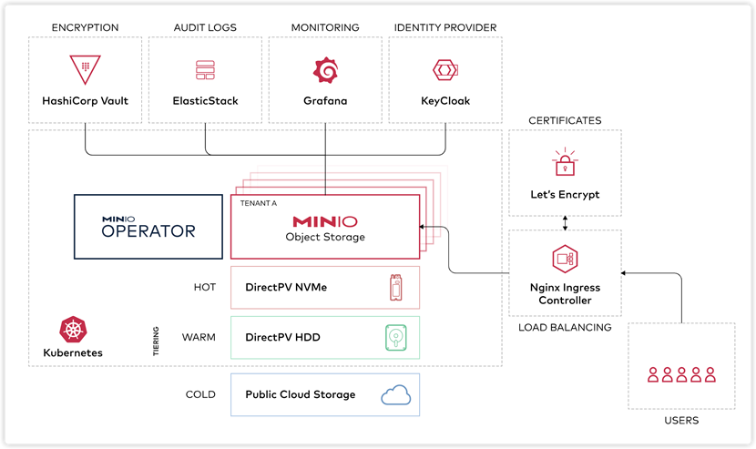

其设计的主要目标是作为私有云对象存储的标准方案。主要用于存储海量的图片，视频，文档等。非常适合于存储大容量非结构化的数据，例如图片、视频、日志文件、备份数据和容器/虚拟机镜像等，而一个对象文件可以是任意大小，从几KB到最大5T不等。

MinIO支持灵活的部署方式，可以部署单机版或者分布式部署部署，也可以将MinIO服务部署在Kubernetes集群中，本文将尝试在OCI OKE服务上部署MinIO，提供支持多租户的云原生对象存储方案。

环境准备

- Kubernetes环境

  使用OCI部署好的OKE实例

- OCI DNS资源

  使用申请好的testoci.xyz域名, 托管在OCI DNS服务上

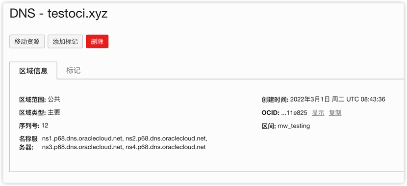

OKE上部署MinIO

minio官方推荐使用minio-operator部署多租户的minio系统。每个 MinIO Tenant 代表 Kubernetes 集群中的一个独立的 MinIO Object Store。

**安装minio operator**

MinIO Operator 扩展了 Kubernetes API 以支持将 MinIO 特定资源部署为 Kubernetes 集群中的租户。
MinIOkubectl minio插件封装了 Operator，为通过kubectl命令行工具在 Kubernetes 集群中部署和管理 MinIO Tenants 提供了一个简化的界面 。
安装minio operator 我们可以选择helm 或者使用官方提供的kubectl minio 插件的方式，这里我们使用kubectl minio 插件的方式安装。

**下载kubectl minio插件**
kubectl krew install minio

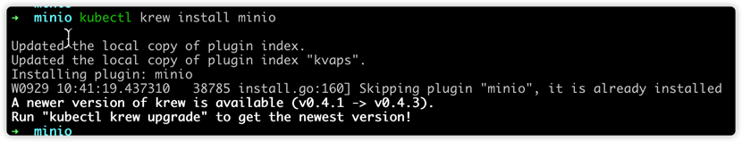

我们下载后可以查看一下信息
kubectl minio version

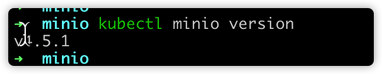

**初始化 MinIO Kubernetes Operator**
运行命令初始化 MinIO Operator：kubectl minio init

该命令使用以下默认设置初始化 MinIO Operator：

- 将 Operator 部署到minio-operator命名空间中。指定参数以将运算符部署到不同的命名空间。kubectl minio init --namespace
- 使用cluster.local配置运营商的DNS主机名，当作为集群域。指定 参数以设置不同的集群域值。kubectl minio init --cluster-domain

这里我们使用默认的参数进行初始化

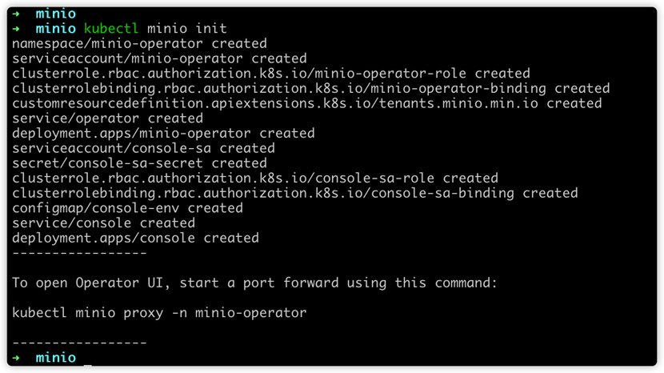

**验证安装**
验证安装我们可以使用kubectl get all --namespace minio-operator命令，如果您使用自定义命名空间初始化 Operator，请替换 minio-operator为该命名空间。

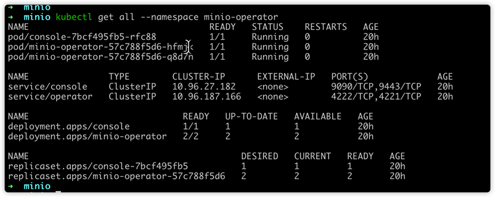

部署一个MinIO 租户

部署一个minio租户我们有多种方式，这里先介绍使用控制台和kubectl minio 插件的方式部署。

**为租户创建名称空间**
首先创建一个名为minio的namespace，后续我们将minio租户部署在这个namespace中。
kubectl create ns tenant1-ns
 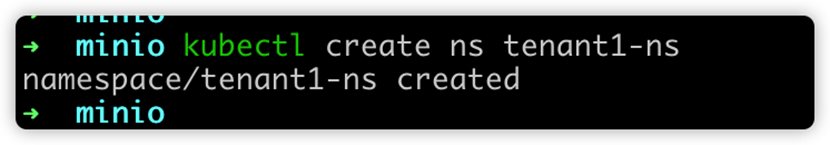

**创建minio租户**
我们可以使用kubectl minio tenant create创建minio租户,我们使用如下命令创建一个一个节点的minio租户，4个存储，总容量为4Gi
kubectl minio tenant create --name tenant1 --servers 1 --volumes 2 --capacity 200G --namespace tenant1-ns --storage-class default

成功后，该命令将返回以下内容：

- 租户的管理用户名和密码。将这些凭据存储在安全位置，例如受密码保护的密钥管理器。MinIO不再显示这些凭据。
- 为连接到 MinIO 控制台而创建的服务。控制台支持对租户的管理操作，例如配置身份和访问管理 (IAM) 和存储桶配置。
- 为连接到 MinIO 租户而创建的服务。应用程序应使用此服务对 MinIO 租户执行操作。

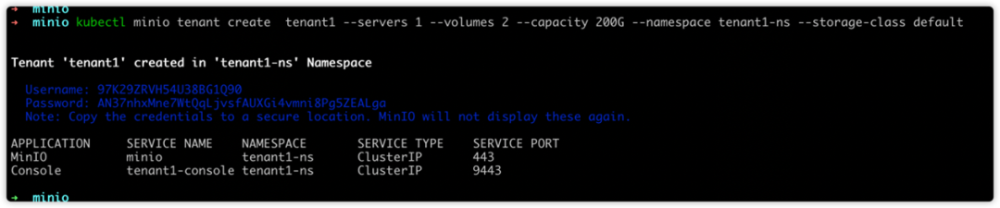

访问服务

我们可以观察下部署了哪些组件和服务

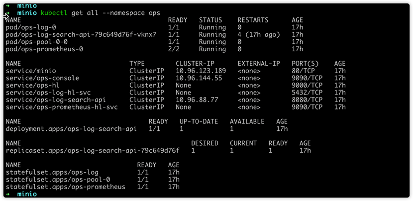

- service/minio是对应minio的服务，我们可以使用这个service访问这个minio 租户提供对象存储能力
- service/ops-console这个对应的是这个minio租户的console服务，我们可以使用这个service访问这个minio 租户的console控制台
- service/ops-hl 这个是个headless服务，用于pod间通讯

默认情况下，每个服务仅在 Kubernetes 集群中可见。部署在集群内的应用程序可以使用 CLUSTER-IP. 对于 Kubernetes 集群外部的应用程序，您必须配置适当的网络规则以公开对服务的访问。Kubernetes 提供了多个选项来配置对服务的外部访问，比如可以使用ingress或者service 配置为nodeport类型。
此文档中, 使用Ingress 暴露Minio 的API 服务和console服务, 在OKE集群中已经部署了Nginx Ingress Controller和CertManager,分别提供Servcie对外的访问,以及TLS证书的管理。

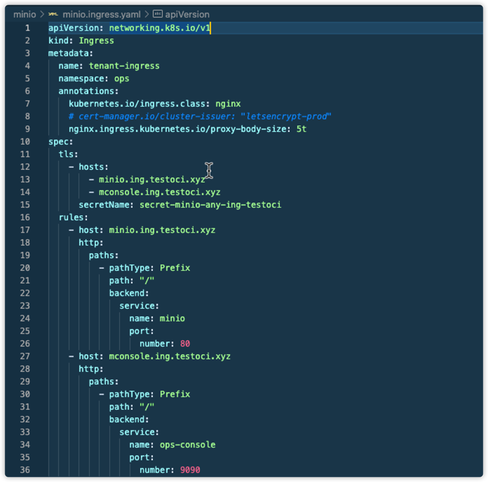

控制台访问
 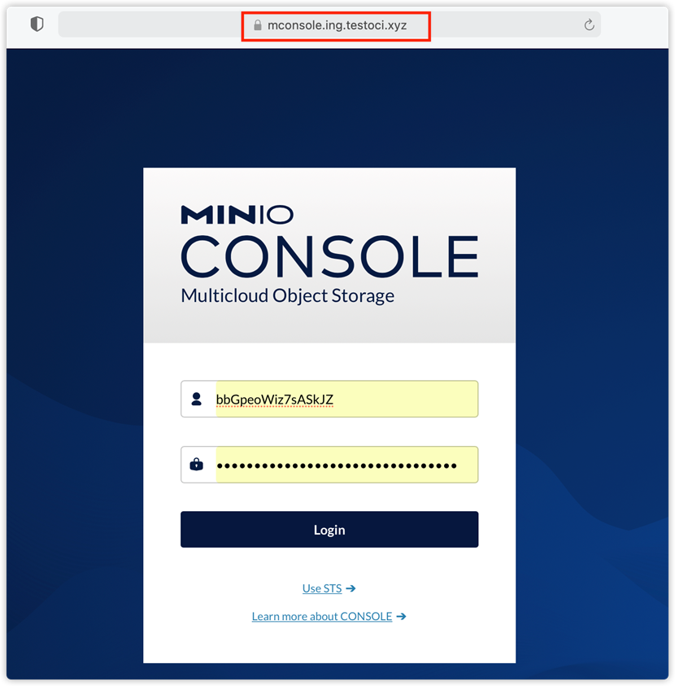

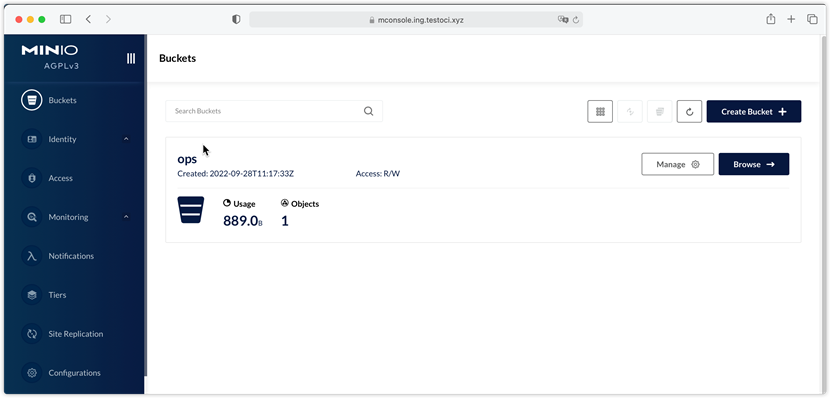

通过S3 API 访问

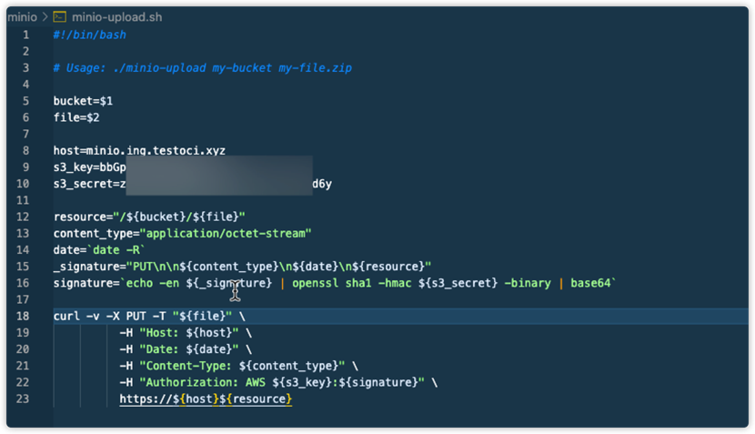

通过S3 API 上传文件成功

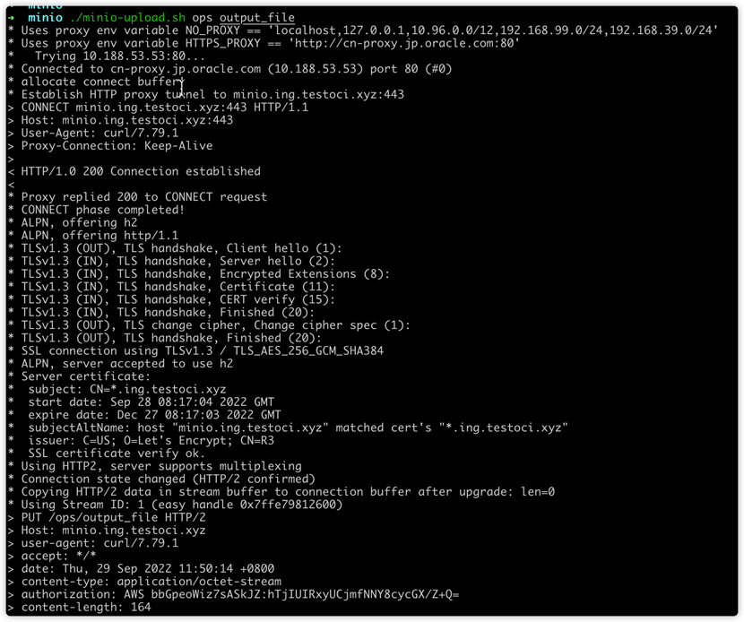

通过以上操作,在OCI的OKE环境中,可以看到通过Cert-Manager和Let's Encrypt, 可以自动管理管理Kubernetes环境中CA证书的自动分发和管理工作。

参考文档：

- [OKE上部署MinIO，自建多租户对象存储解决方案](https://mp.weixin.qq.com/s?__biz=MzU0MTAyMDE5NQ==&mid=2247488038&idx=1&sn=24a0d3de9a66167a57015073e42145a6&chksm=fb310b6acc46827c93ca74c65eaa6744b8abaea03b4c87b2639024e8de242edab895be138433&mpshare=1&scene=24&srcid=1031SCdfm3ZCIZwHqz6ZMwuE&sharer_sharetime=1667162295775&sharer_shareid=1b95f6081a12c51bd1871f76c4d83505#rd)

[返回OKE中文文档集](../README.md)